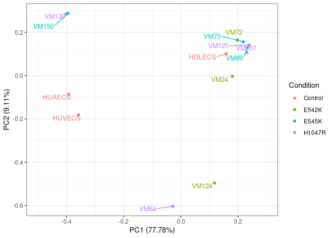
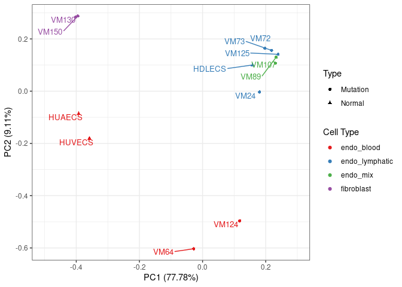
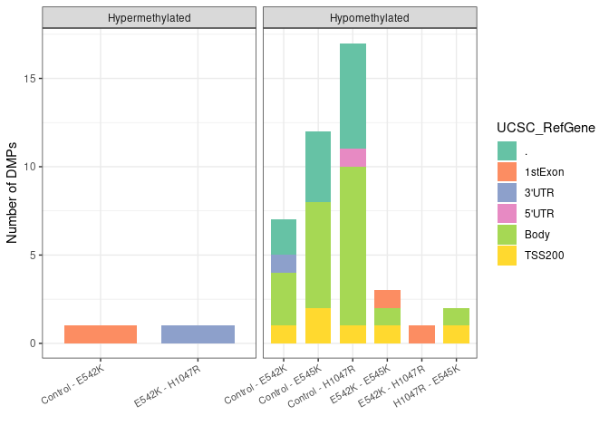

Analysis of human methylation data with R
================

<!-- README.md is generated from human_methylation.Rmd -->

## Required packages

``` r
library(minfi)
library(limma)
library(DMRcate)
library(maxprobes)
library(IlluminaHumanMethylationEPICanno.ilm10b4.hg19)
library(IlluminaHumanMethylationEPICmanifest)
library(readxl)
library(dplyr)
library(ggplot2)
library(ggrepel)
library(ggfortify)
library(gplots)
library(RColorBrewer)
```

## Loading the data

### Methylation data

The data for this study was produced by the Infinium MethylationEPIC
BeadChip array designed by Illumina in 2016, which quantifies the
methylation levels in more than 850,000 different CpG sites of the human
genome.

The following function from
[*minfi*](https://bioconductor.org/packages/devel/bioc/vignettes/minfi/inst/doc/minfi.html)
can read the IDAT files produced by the array and stores the data in a
RGChannelSet object.

``` r
rgSet <- read.metharray.exp("data/human/")
class(rgSet)[1]
```

    ## [1] "RGChannelSet"

### Metadata

The metadata file contains some relevant information of the samples,
such as their name, the mutation they present, or from which cell types
were they obtained.

``` r
metadata <- as.data.frame(read_excel("data/human/PIK3CA_samples_SC.xlsx"))

# renaming and removing redundant information
names(metadata)[1:10] <- c("Sample", "Organism", "Tissue", "Type", "Condition", "Preservation", 
                           "DNA_quantity", "EPIC_ID", "EPIC_position", "EPIC_barcode")
metadata$CellType <- paste(metadata$CellType1, metadata$CellType2, sep="_" )
metadata$CellType <- gsub("thelial","", gsub("_NA","", as.character(metadata$CellType)))
metadata$Condition <- gsub("pik3ca ","", as.character(metadata$Condition))
metadata$Type <- gsub("Vascular malformation", "Mutation", metadata$Type)
metadata <- metadata[,-c(2, 3, 6, 8, 9, 12, 13, 14)]

head(metadata)
```

    ##   Sample     Type Condition DNA_quantity        EPIC_barcode       CellType
    ## 1 HUVECS   Normal   Control           83 205832320126_R03C01     endo_blood
    ## 2 HDLECS   Normal   Control           75 205832320126_R04C01 endo_lymphatic
    ## 3 HUAECS   Normal   Control           63 205832320126_R05C01     endo_blood
    ## 4   VM64 Mutation    H1047R           56 205832320126_R06C01     endo_blood
    ## 5  VM125 Mutation    H1047R           80 205832320126_R07C01 endo_lymphatic
    ## 6  VM130 Mutation    H1047R           67 205832320126_R08C01     fibroblast

## Quality control

### QC report

*minfi* incorporates a function that generates a quality control report
of the raw data in PDF format, including plots for the distribution of
the beta-values and the intensities at the green and red channels.

``` r
# quality control report for the raw data
qcReport(rgSet, pdf="results/human/qcReport.pdf", sampGroups=metadata$Condition, sampNames=metadata$Sample)
```

### Detection p-values

Detection p-values provide a measure of how likely the signal of a probe
is different from the background. The following plot includes the mean
of the detection p-values of every sample compared to the cutoff
(p=0.01).

``` r
# detection p-values
p_values <- detectionP(rgSet, type = "m+u")

# mean detection p-values
mean_p <- data.frame(p_values=colMeans(p_values), Sample=metadata$Sample)

# plotting the mean detection p-values
ggplot(mean_p, aes(x=Sample, y=p_values, fill=p_values))+
  geom_col()+
  geom_hline(yintercept=0.01, linetype="dashed", color="red")+
  ggtitle("Mean detection p-value per sample")+
  theme_bw()+
  theme(legend.position="none", axis.title.x=element_blank(), axis.title.y=element_blank(), 
        axis.text.x=element_text(angle=30, vjust=1, hjust=1))
```

<!-- -->

## Preprocessing

### ssNoob normalization

*minfi* also offers the possibility to use some different functions to
normalize the raw data:

-   preprocessRaw: no normalization.
-   preprocessIllumina: Illumina’s GenomeStudio preprocessing.
-   preprocessSWAN: subset-quantile within array normalization.
-   preprocessQuantile: quantile normalization.
-   preprocessNoob: normal-exponential out-of-band background
    correction.
-   preprocessFunnorm: functional normalization.

Find more information about the different preprocessing methods
[here](https://www.bioconductor.org/help/course-materials/2015/BioC2015/methylation450k.html#preprocessing-and-normalization).

``` r
mSet <- preprocessNoob(rgSet)
class(mSet)[1]
```

    ## [1] "MethylSet"

### Removing low quality probes

Probes presenting a detection p-value above the threshold (p=0.01) could
be generated by the background signal and may not be reliable. Those
sites should be removed to avoid type I errors.

``` r
keep <- rowSums(p_values < 0.01) == ncol(mSet)
mSet <- mSet[keep,]
```

### Removing probes with known SNP’s

``` r
gmSet <- dropLociWithSnps(mapToGenome(mSet))
class(gmSet)[1]
```

    ## [1] "GenomicMethylSet"

### Removing cross reactive probes

We would also be interested in removing the cross-reactive probes, which
are sites found to map at different genome locations.

``` r
xreactive_probes <- xreactive_probes(array_type="EPIC")
keep <- !(featureNames(gmSet) %in% xreactive_probes)
gmSet <- gmSet[keep,]
```

### Removing sex chromosomes probes

As in this analysis gender is not a factor of interest, the CpG sites
present at the sexual chromosomes (chrX and chrY) should be removed to
avoid possible biases caused by other factors. Otherwise, if we were
interested in comparing the methylation between males and females, those
must be kept.

``` r
ann <- getAnnotation(IlluminaHumanMethylationEPICanno.ilm10b4.hg19)
keep <- !(featureNames(gmSet) %in% ann$Name[ann$chr %in% c("chrX","chrY")])
gmSet <- gmSet[keep,]
```

### Obtaining the beta values

The beta-value is a measurement of the methylation at every CpG site
obtained using the following formula:
.
This ratio ranges between 0 and 1 representing a completely unmethylated
or methylated site, respectively.

``` r
beta_values <- getBeta(gmSet)
colnames(beta_values) <- metadata$Sample
head(beta_values[,1:6])
```

    ##               HUVECS    HDLECS    HUAECS      VM64     VM125     VM130
    ## cg26928153 0.8912966 0.9291646 0.9008487 0.9208086 0.8975076 0.8765710
    ## cg16269199 0.7217106 0.8779706 0.7257139 0.7652507 0.8260288 0.5582238
    ## cg13869341 0.8169154 0.9312310 0.8497294 0.9202811 0.8743728 0.8745551
    ## cg24669183 0.7814387 0.7503673 0.8029873 0.8039348 0.8153838 0.7674553
    ## cg26679879 0.4946208 0.4945805 0.4945518 0.5173384 0.4840949 0.5003178
    ## cg22519184 0.5386525 0.5379105 0.5434246 0.5342965 0.5453343 0.5494639

## Principal Component Analysis

PCA is a dimensionality reduction technique used to reduce a data set
with a large number of features into a few called principal components,
which explains as much variance as possible in order to be able to
represent the data in two or three dimensions.

### PCA on the most variable sites

Selecting the most variable sites may be a good approach to reduce the
number of inputs for the PCA and speed up the calculation without using
probes that don’t explain differences in the data.

``` r
# selecting the top 100 most variable CpGs
sdv <- apply(beta_values,1, sd)
keep <- names(head(sort(sdv,decreasing=T), 100))
beta_top100 <- beta_values[keep,]

# PCA
pca_res <- prcomp(t(beta_top100), scale=T, center=T)
```

### Plotting the PCA by condition

``` r
autoplot(pca_res, x=1, y=2,data=metadata, colour="Condition")+
  geom_text_repel(aes(label=Sample, color=Condition),hjust=-0.1, vjust=0, show.legend=F, size=3.5)+
  xlim(c(-0.5,0.3)) +
  theme_bw()
```

<!-- -->

### Plotting the PCA by cell type

``` r
autoplot(pca_res, x=1, y=2,data=metadata, colour="CellType", shape = "Type")+
  geom_text_repel(aes(label=Sample, color=CellType),hjust=-0.1, vjust=0, show.legend=F, size=3.5)+
  scale_color_brewer(palette = "Set1")+ 
  labs(colour="Cell Type") + xlim(c(-0.5,0.3)) +
  theme_bw()
```

<!-- -->

## Differential methylation analysis

### Differentially Methylated Positions

DMPs are individual CpG sites showing different methylation levels
across the study groups/samples.

#### Finding the number of DMPs per contrast

Those positions can be detected using
[*limma*](https://www.bioconductor.org/packages/devel/bioc/vignettes/limma/inst/doc/usersguide.pdf)
to build linear models to find significant differences in the beta
values at single probes.

In this case, the samples are grouped according to their condition in
the design matrix, and all those groups are compared against all in the
contrast matrix.

``` r
# building the design matrix
mutation <- factor(metadata$Condition)
designMat <- model.matrix(~0+mutation, data=metadata)
colnames(designMat) <- levels(mutation)

# building the contrast matrix
contMat <- makeContrasts(Control-E542K, 
                         Control-E545K, 
                         Control-H1047R, 
                         E542K-E545K, 
                         E542K-H1047R, 
                         H1047R-E545K, levels=designMat)

# fitting linear model with limma
fit <- lmFit(beta_values, designMat)
fit2 <- contrasts.fit(fit, contMat)
fit2 <- eBayes(fit2)

DMP_summary <- summary(decideTests(fit2, p.value=0.01))
rownames(DMP_summary) <- c("Hyper", "NotSig", "Hypo")
colnames(DMP_summary) <- gsub(" - ","_", colnames(DMP_summary))
DMP_summary
```

    ##        Control_E542K Control_E545K Control_H1047R E542K_E545K E542K_H1047R
    ## Hyper              1             0              0           0            1
    ## NotSig        775512        775508         775503      775517       775518
    ## Hypo               7            12             17           3            1
    ##        H1047R_E545K
    ## Hyper             0
    ## NotSig       775518
    ## Hypo              2

#### Annotating the DMPs

``` r
contrasts <- colnames(contMat)

# matching beta values with annotation by the probe names
annEPICSub <- ann[match(rownames(beta_values),ann$Name), c(1:4,12:19,22:ncol(ann))]

DMP.list=list() # list to store the DMPs
cg=list() # list to store the names of significant probes

for (i in 1:length(contrasts)){
  # extract the significant DMPs and annotate
  DMP <- topTable(fit2, num=Inf, coef=i, genelist=annEPICSub, p.value=0.01)
  DMP$Contrast <- contrasts[i]
  # saving the results
  DMP.list[[i]] <- DMP
  cg[[i]] <- row.names(DMP)
  # write.csv(DMP_1, file=paste0("results/human/DMP/DMP_", contrasts[i], ".csv"))
}

# merging all the DMPs
DMP_ann <- do.call(rbind, DMP.list)

# classifying DMPs according to its change in methylation
DMP_ann$Type <- "Hypermethylated"
DMP_ann$Type[which(DMP_ann$logFC > 0)] <- "Hypomethylated"

# gene feature annotation
DMP_ann$UCSC_RefGene_Group[which(DMP_ann$UCSC_RefGene_Group == "")] <- "."
DMP_ann$UCSC_RefGene_Group_short <- unlist(lapply(strsplit(DMP_ann$UCSC_RefGene_Group, ";"),'[[', 1))
```

#### Plotting DMPs in relation with CpG Islands

``` r
DMP_annCGI <- DMP_ann[, c("Contrast", "Relation_to_Island", "Type")]

ggplot(DMP_annCGI, aes(Contrast, fill=Relation_to_Island))+
  facet_wrap(.~Type, scales="free_x")+
  geom_histogram(stat="count", width=0.75)+
  theme_bw()+ 
  theme(axis.text.x=element_text(angle=30, hjust=1, size=8))+
  ylab("Number of DMPs")+ 
  xlab("")
```

<!-- -->

#### Plotting DMPs in relation with the gene features

``` r
DMP_Gene_Group <- DMP_ann[,c("Contrast","UCSC_RefGene_Group_short", "Type")]

ggplot(DMP_Gene_Group, aes(Contrast, fill=UCSC_RefGene_Group_short))+
  facet_wrap(.~Type, scales="free_x")+
  geom_histogram(stat="count", width=0.75)+ 
  theme_bw()+ 
  scale_fill_brewer(palette="Set2")+
  theme(axis.text.x=element_text(angle=30, hjust=1, size=8))+
  ylab("Number of DMPs")+
  xlab("")+ 
  labs(fill="UCSC_RefGene")
```

<!-- -->

#### Heatmap

``` r
# joining the DMPs with their beta values
DMP_beta <- data.frame(beta_values[unlist(cg), ])
colnames(DMP_beta) <- paste0(metadata$Sample,"_",metadata$Condition)

colors <- colorRampPalette(c("royalblue", "white", "red"))(n=100) # range of colors
heatmap.2(as.matrix(t(unique(DMP_beta))), trace="none", density.inf="none", 
          margins=c(7,10), col=colors, cexRow = 1, lwid = c(5,15), lhei = c(5,15))
```

<!-- -->

### Differentially Methylated Regions

DMRs are regions formed by CpG sites where the difference in methylation
levels across the groups/samples is higher than those outside this
region.

#### Finding and annotating the DMRs

[*DMRcate*](https://bioconductor.org/packages/devel/bioc/vignettes/DMRcate/inst/doc/DMRcate.pdf)
is a package that allows the finding and the annotation of DMRs from the
beta values. It generates a GenomicRanges object that contains the
coordinates of the DMR, some statistics that support the finding, and
the symbols of the genes that overlap the DMR (in case there are).

``` r
DMR.list <- list()
for(i in 1:length(contrasts)){
  # annotating the CpGs for each contrast + finding significant CpGs
  myAnnotation <- cpg.annotate(object=beta_values, datatype="array", what="Beta", analysis.type="differential", 
                               design=designMat, contrasts=T, cont.matrix=contMat, 
                               coef=gsub("_", " - ", as.character(contrasts[i])), arraytype="EPIC")

  if (sum(myAnnotation@ranges@elementMetadata@listData$is.sig)!=0){ # if there are significant CpGs
    # test for DMRs
    DMRs <- dmrcate(myAnnotation, lambda=1000, C=2)
    # extract genomic ranges
    results.ranges <- extractRanges(DMRs)
    # saving the results
    DMR.list[[i]] <- data.frame(Contrast=contrasts[i], results.ranges)
    # write.csv(results.ranges, paste0("results/human/DMR/DMR_", contrasts[i], ".csv"))
  }
}

# showing the found DMRs for the first contrast: control vs E542K
head(DMR.list[1])
```

    ## [[1]]
    ##          Contrast seqnames     start       end width strand no.cpgs
    ## 1 Control - E542K     chr5   1020022   1020109    88      *       2
    ## 2 Control - E542K     chr8 145008288 145008397   110      *       2
    ## 3 Control - E542K    chr11  27015473  27015991   519      *       8
    ## 4 Control - E542K     chr5 134915042 134915537   496      *       6
    ## 5 Control - E542K    chr11  70672388  70673256   869      *       9
    ##   min_smoothed_fdr   Stouffer      HMFDR     Fisher   maxdiff   meandiff
    ## 1     2.456459e-68 0.00976076 0.02889042 0.01436722 0.7823588 0.62148931
    ## 2     9.672514e-50 0.02531698 0.06191474 0.03741945 0.1501846 0.15003989
    ## 3     3.221919e-56 0.07792210 0.12143869 0.09306007 0.2966237 0.10975408
    ## 4     1.005501e-48 0.11892097 0.10813082 0.11864377 0.1713289 0.08547115
    ## 5     3.509451e-53 0.06845258 0.16886550 0.15948058 0.4248418 0.22080470
    ##   overlapping.genes
    ## 1              NKD2
    ## 2              PLEC
    ## 3             FIBIN
    ## 4      CTC-321K16.1
    ## 5            SHANK2

#### Plotting the DMRs

This package also provides a function to plot the DMRs using different
tracks with the
[*Gviz*](https://bioconductor.org/packages/devel/bioc/vignettes/Gviz/inst/doc/Gviz.html)
package, including:

-   The genomic coordinates.
-   The gene model: showing near or overlapping genes.
-   The heatmap of the methylation values.
-   The distribution of the mean methylation levels.

``` r
pal <- brewer.pal(8, "Dark2") # palette

# to colour by mutation (condition)
groups <- pal[1:length(unique(metadata$Condition))]
names(groups) <- levels(factor(metadata$Condition))
cols <- groups[as.character(factor(metadata$Condition))]

# is needed to convert the data frame into a genomic ranges object
DMR.GR <- makeGRangesFromDataFrame(DMR.list[3])

DMR.plot(ranges=DMR.GR, dmr=10, CpGs=beta_values, phen.col=cols, what="Beta", arraytype="EPIC", genome="hg19")
```

<!-- -->

## Session information

    ## R version 4.1.2 (2021-11-01)
    ## Platform: x86_64-redhat-linux-gnu (64-bit)
    ## Running under: Rocky Linux 8.5 (Green Obsidian)
    ## 
    ## Matrix products: default
    ## BLAS/LAPACK: /usr/lib64/libopenblas-r0.3.12.so
    ## 
    ## locale:
    ##  [1] LC_CTYPE=en_GB.UTF-8       LC_NUMERIC=C              
    ##  [3] LC_TIME=en_GB.UTF-8        LC_COLLATE=en_GB.UTF-8    
    ##  [5] LC_MONETARY=en_GB.UTF-8    LC_MESSAGES=en_GB.UTF-8   
    ##  [7] LC_PAPER=en_GB.UTF-8       LC_NAME=C                 
    ##  [9] LC_ADDRESS=C               LC_TELEPHONE=C            
    ## [11] LC_MEASUREMENT=en_GB.UTF-8 LC_IDENTIFICATION=C       
    ## 
    ## attached base packages:
    ## [1] parallel  stats4    stats     graphics  grDevices utils     datasets 
    ## [8] methods   base     
    ## 
    ## other attached packages:
    ##  [1] DMRcatedata_2.12.0                                 
    ##  [2] ExperimentHub_2.2.1                                
    ##  [3] AnnotationHub_3.2.2                                
    ##  [4] BiocFileCache_2.2.1                                
    ##  [5] dbplyr_2.1.1                                       
    ##  [6] RColorBrewer_1.1-2                                 
    ##  [7] gplots_3.1.1                                       
    ##  [8] ggfortify_0.4.14                                   
    ##  [9] ggrepel_0.9.1                                      
    ## [10] ggplot2_3.3.5                                      
    ## [11] dplyr_1.0.8                                        
    ## [12] readxl_1.3.1                                       
    ## [13] IlluminaHumanMethylationEPICmanifest_0.3.0         
    ## [14] IlluminaHumanMethylationEPICanno.ilm10b4.hg19_0.6.0
    ## [15] maxprobes_0.0.2                                    
    ## [16] DMRcate_2.8.3                                      
    ## [17] limma_3.50.1                                       
    ## [18] minfi_1.40.0                                       
    ## [19] bumphunter_1.36.0                                  
    ## [20] locfit_1.5-9.5                                     
    ## [21] iterators_1.0.14                                   
    ## [22] foreach_1.5.2                                      
    ## [23] Biostrings_2.62.0                                  
    ## [24] XVector_0.34.0                                     
    ## [25] SummarizedExperiment_1.24.0                        
    ## [26] Biobase_2.54.0                                     
    ## [27] MatrixGenerics_1.6.0                               
    ## [28] matrixStats_0.61.0                                 
    ## [29] GenomicRanges_1.46.1                               
    ## [30] GenomeInfoDb_1.30.1                                
    ## [31] IRanges_2.28.0                                     
    ## [32] S4Vectors_0.32.3                                   
    ## [33] BiocGenerics_0.40.0                                
    ## 
    ## loaded via a namespace (and not attached):
    ##   [1] utf8_1.2.2                                        
    ##   [2] R.utils_2.11.0                                    
    ##   [3] tidyselect_1.1.2                                  
    ##   [4] RSQLite_2.2.10                                    
    ##   [5] AnnotationDbi_1.56.2                              
    ##   [6] htmlwidgets_1.5.4                                 
    ##   [7] grid_4.1.2                                        
    ##   [8] BiocParallel_1.28.3                               
    ##   [9] munsell_0.5.0                                     
    ##  [10] codetools_0.2-18                                  
    ##  [11] preprocessCore_1.56.0                             
    ##  [12] statmod_1.4.36                                    
    ##  [13] withr_2.5.0                                       
    ##  [14] colorspace_2.0-3                                  
    ##  [15] filelock_1.0.2                                    
    ##  [16] highr_0.9                                         
    ##  [17] knitr_1.37                                        
    ##  [18] rstudioapi_0.13                                   
    ##  [19] labeling_0.4.2                                    
    ##  [20] GenomeInfoDbData_1.2.7                            
    ##  [21] farver_2.1.0                                      
    ##  [22] bit64_4.0.5                                       
    ##  [23] rhdf5_2.38.0                                      
    ##  [24] vctrs_0.3.8                                       
    ##  [25] generics_0.1.2                                    
    ##  [26] xfun_0.30                                         
    ##  [27] biovizBase_1.42.0                                 
    ##  [28] R6_2.5.1                                          
    ##  [29] illuminaio_0.36.0                                 
    ##  [30] AnnotationFilter_1.18.0                           
    ##  [31] bitops_1.0-7                                      
    ##  [32] rhdf5filters_1.6.0                                
    ##  [33] cachem_1.0.6                                      
    ##  [34] reshape_0.8.8                                     
    ##  [35] DelayedArray_0.20.0                               
    ##  [36] assertthat_0.2.1                                  
    ##  [37] IlluminaHumanMethylation450kanno.ilmn12.hg19_0.6.0
    ##  [38] promises_1.2.0.1                                  
    ##  [39] BiocIO_1.4.0                                      
    ##  [40] scales_1.1.1                                      
    ##  [41] bsseq_1.30.0                                      
    ##  [42] nnet_7.3-17                                       
    ##  [43] gtable_0.3.0                                      
    ##  [44] ensembldb_2.18.3                                  
    ##  [45] rlang_1.0.1                                       
    ##  [46] genefilter_1.76.0                                 
    ##  [47] splines_4.1.2                                     
    ##  [48] rtracklayer_1.54.0                                
    ##  [49] lazyeval_0.2.2                                    
    ##  [50] DSS_2.42.0                                        
    ##  [51] GEOquery_2.62.2                                   
    ##  [52] dichromat_2.0-0                                   
    ##  [53] checkmate_2.0.0                                   
    ##  [54] BiocManager_1.30.16                               
    ##  [55] yaml_2.3.5                                        
    ##  [56] GenomicFeatures_1.46.5                            
    ##  [57] backports_1.4.1                                   
    ##  [58] httpuv_1.6.5                                      
    ##  [59] Hmisc_4.6-0                                       
    ##  [60] tools_4.1.2                                       
    ##  [61] nor1mix_1.3-0                                     
    ##  [62] ellipsis_0.3.2                                    
    ##  [63] siggenes_1.68.0                                   
    ##  [64] Rcpp_1.0.8                                        
    ##  [65] plyr_1.8.6                                        
    ##  [66] base64enc_0.1-3                                   
    ##  [67] sparseMatrixStats_1.6.0                           
    ##  [68] progress_1.2.2                                    
    ##  [69] zlibbioc_1.40.0                                   
    ##  [70] purrr_0.3.4                                       
    ##  [71] RCurl_1.98-1.6                                    
    ##  [72] prettyunits_1.1.1                                 
    ##  [73] rpart_4.1-15                                      
    ##  [74] openssl_2.0.0                                     
    ##  [75] cluster_2.1.2                                     
    ##  [76] magrittr_2.0.2                                    
    ##  [77] data.table_1.14.2                                 
    ##  [78] ProtGenerics_1.26.0                               
    ##  [79] missMethyl_1.28.0                                 
    ##  [80] mime_0.12                                         
    ##  [81] hms_1.1.1                                         
    ##  [82] evaluate_0.15                                     
    ##  [83] xtable_1.8-4                                      
    ##  [84] XML_3.99-0.9                                      
    ##  [85] jpeg_0.1-9                                        
    ##  [86] mclust_5.4.9                                      
    ##  [87] gridExtra_2.3                                     
    ##  [88] compiler_4.1.2                                    
    ##  [89] biomaRt_2.50.3                                    
    ##  [90] tibble_3.1.6                                      
    ##  [91] KernSmooth_2.23-20                                
    ##  [92] crayon_1.5.0                                      
    ##  [93] R.oo_1.24.0                                       
    ##  [94] htmltools_0.5.2                                   
    ##  [95] later_1.3.0                                       
    ##  [96] tzdb_0.2.0                                        
    ##  [97] Formula_1.2-4                                     
    ##  [98] tidyr_1.2.0                                       
    ##  [99] DBI_1.1.2                                         
    ## [100] MASS_7.3-55                                       
    ## [101] rappdirs_0.3.3                                    
    ## [102] Matrix_1.4-0                                      
    ## [103] readr_2.1.2                                       
    ## [104] permute_0.9-7                                     
    ## [105] cli_3.2.0                                         
    ## [106] quadprog_1.5-8                                    
    ## [107] R.methodsS3_1.8.1                                 
    ## [108] Gviz_1.38.2                                       
    ## [109] pkgconfig_2.0.3                                   
    ## [110] GenomicAlignments_1.30.0                          
    ## [111] foreign_0.8-82                                    
    ## [112] xml2_1.3.3                                        
    ## [113] annotate_1.72.0                                   
    ## [114] rngtools_1.5.2                                    
    ## [115] multtest_2.50.0                                   
    ## [116] beanplot_1.2                                      
    ## [117] doRNG_1.8.2                                       
    ## [118] scrime_1.3.5                                      
    ## [119] stringr_1.4.0                                     
    ## [120] VariantAnnotation_1.40.0                          
    ## [121] digest_0.6.29                                     
    ## [122] cellranger_1.1.0                                  
    ## [123] rmarkdown_2.12                                    
    ## [124] base64_2.0                                        
    ## [125] htmlTable_2.4.0                                   
    ## [126] edgeR_3.36.0                                      
    ## [127] DelayedMatrixStats_1.16.0                         
    ## [128] restfulr_0.0.13                                   
    ## [129] curl_4.3.2                                        
    ## [130] shiny_1.7.1                                       
    ## [131] Rsamtools_2.10.0                                  
    ## [132] gtools_3.9.2                                      
    ## [133] rjson_0.2.21                                      
    ## [134] lifecycle_1.0.1                                   
    ## [135] nlme_3.1-155                                      
    ## [136] Rhdf5lib_1.16.0                                   
    ## [137] askpass_1.1                                       
    ## [138] BSgenome_1.62.0                                   
    ## [139] fansi_1.0.2                                       
    ## [140] pillar_1.7.0                                      
    ## [141] lattice_0.20-45                                   
    ## [142] KEGGREST_1.34.0                                   
    ## [143] fastmap_1.1.0                                     
    ## [144] httr_1.4.2                                        
    ## [145] survival_3.2-13                                   
    ## [146] interactiveDisplayBase_1.32.0                     
    ## [147] glue_1.6.2                                        
    ## [148] png_0.1-7                                         
    ## [149] BiocVersion_3.14.0                                
    ## [150] bit_4.0.4                                         
    ## [151] stringi_1.7.6                                     
    ## [152] HDF5Array_1.22.1                                  
    ## [153] blob_1.2.2                                        
    ## [154] org.Hs.eg.db_3.14.0                               
    ## [155] caTools_1.18.2                                    
    ## [156] latticeExtra_0.6-29                               
    ## [157] memoise_2.0.1
