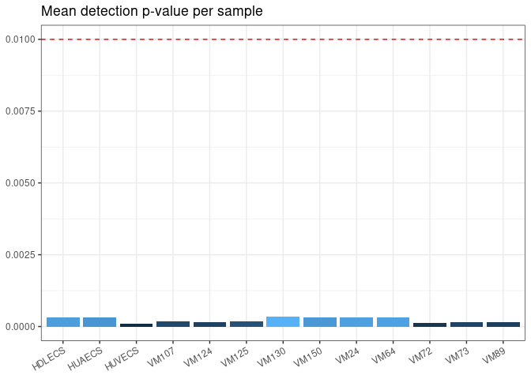
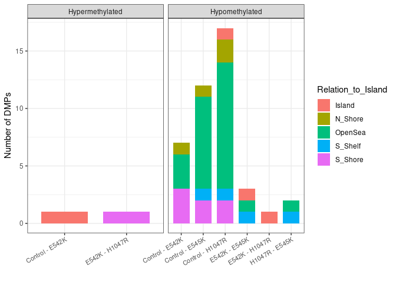
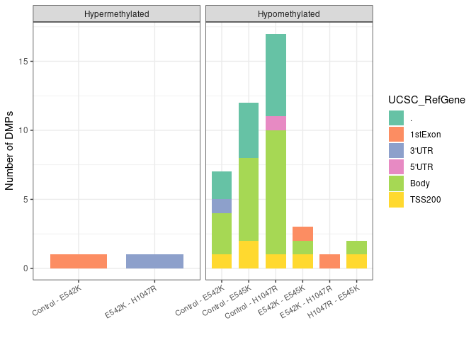
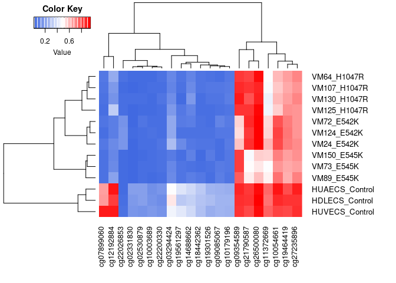

## Workflow for Analyzing Human Methylation Array Data with Infinium Methylation EPIC using R

This comprehensive workflow guides you through the analysis of human methylation array data obtained from the **Infinium Methylation EPIC** platform. The primary tools utilized are three Bioconductor packages: `minfi`, `limma`, and `DMRcate`. The workflow encompasses data import, preprocessing, and differential methylation analysis, with a focus on identifying and annotating differentially methylated positions (DMPs) and regions (DMRs).

> This is the markdown version of [EPIC.R](https://github.com/raulsanzr/methylation/blob/main/R/EPIC.R). You can also find the pipeline to analize **Infinium Mouse Methylation** [here](https://github.com/raulsanzr/methylation/blob/main/R/mouse.R).

## Libraries

``` r
library(minfi)
library(limma)
library(DMRcate)
library(maxprobes)
library(readxl)
library(dplyr)
library(ggplot2)
library(ggrepel)
library(ggfortify)
library(gplots)
library(RColorBrewer)
```

## Loading the data

### Methylation data

The data for this study was generated using the Infinium MethylationEPIC BeadChip array, designed by Illumina in 2016. This microarray assesses methylation levels across more than 850,000 distinct CpG sites within the human genome. Nevertheless, this workflow is adaptable to data from the preceding chip version (*Infinium HumanMethylation450 BeadChip*) by adjusting a few parameters.

The `minfi` package includes a function capable of reading all IDAT files produced by the array. This function organizes the data into an RGChannelSet object, complete with corresponding annotations.

``` r
rgSet <- read.metharray.exp("data/")
```

### Metadata

The metadata comprises essential information about the samples, which will be valuable later for grouping purposes.

``` r
metadata <- as.data.frame(read_excel("metadata.xlsx"))
head(metadata)
```

    ##   Sample     Type Condition DNA_quantity        EPIC_barcode       CellType
    ## 1 HUVECS   Normal   Control           83 205832320126_R03C01     endo_blood
    ## 2 HDLECS   Normal   Control           75 205832320126_R04C01 endo_lymphatic
    ## 3 HUAECS   Normal   Control           63 205832320126_R05C01     endo_blood
    ## 4   VM64 Mutation    H1047R           56 205832320126_R06C01     endo_blood
    ## 5  VM125 Mutation    H1047R           80 205832320126_R07C01 endo_lymphatic
    ## 6  VM130 Mutation    H1047R           67 205832320126_R08C01     fibroblast

## Quality control

### QC report

Within the `minfi` package, there exists a function that produces a quality control report in PDF format directly from the raw data. This report includes informative plots depicting the distribution of methylation intensities detected at each step for every sample.

``` r
qcReport(rgSet, pdf="qcReport.pdf", sampGroups=metadata$Condition, sampNames=metadata$Sample)
```

### Detection p-values

Detection p-values offer a quantification of the likelihood that the signal from a probe differs from the background. The subsequent barplot illustrates the mean of detection p-values for each sample concerning a specified cutoff ().

``` r
# Detection p-values
p_values <- detectionP(rgSet, type="m+u")

# Mean detection p-values
mean_p <- data.frame(p_values=colMeans(p_values), Sample=metadata$Sample)

ggplot(mean_p, aes(x=Sample, y=p_values, fill=p_values))+
  geom_col()+
  geom_hline(yintercept=0.01, linetype="dashed", color="red")+
  ggtitle("Mean detection p-value per sample")+
  theme_bw()+
  theme(legend.position="none", axis.title.x=element_blank(), axis.title.y=element_blank(), 
        axis.text.x=element_text(angle=30, vjust=1, hjust=1))
```

<!-- -->

## Preprocessing

### Normalization

`minfi` provides various options for data normalization, and the choice depends on the specific characteristics of the data under analysis:

-   `preprocessRaw`: No normalization applied.
-   `preprocessIllumina`: Illumina’s GenomeStudio preprocessing.
-   `preprocessSWAN`: Subset-quantile within-array normalization.
-   `preprocessQuantile`: Quantile normalization.
-   `preprocessNoob`: Normal-exponential out-of-band background correction.
-   `preprocessFunnorm`: Functional normalization.

> For additional documentation on these preprocessing functions, refer to the [documentation](https://www.bioconductor.org/help/course-materials/2015/BioC2015/methylation450k.html#preprocessing-and-normalization).

``` r
mSet <- preprocessNoob(rgSet)
```

### Removing low quality probes

Probes with a detection p-value exceeding the cutoff () are considered nonsignificant and may lack reliability. It is advisable to exclude such sites to mitigate potential biases.

``` r
keep <- rowSums(p_values < 0.01) == ncol(mSet)
mSet <- mSet[keep,]
```

### Removing probes with known SNPs

It is also recommended to exclude probes with known single nucleotide polymorphisms.

``` r
gmSet <- dropLociWithSnps(mapToGenome(mSet))
```

### Removing cross reactive probes

Cross-reactive probes are those identified to map to different genome locations, often involving both autosomal and sex chromosomes. The following function includes a collection of probes annotated in [Critical evaluation of the Illumina MethylationEPIC BeadChip microarray for whole-genome DNA methylation profiling](https://genomebiology.biomedcentral.com/articles/10.1186/s13059-016-1066-1) and [Identification of polymorphic and off-target probe binding sites on the Illumina Infinium MethylationEPIC BeadChip](https://www.sciencedirect.com/science/article/pii/S221359601630071X) studies.

``` r
xreactive_probes <- xreactive_probes(array_type="EPIC")
keep <- !(featureNames(gmSet) %in% xreactive_probes)
gmSet <- gmSet[keep,]
```

### Removing sex chromosomes probes

Probes that exhibit differential methylation between males and females may result from various factors not considered in the analysis. If the gender of individuals is not a variable under study, it is advisable to exclude these probes. Conversely, if investigating the methylation differences between males and females is of interest, retaining these sites would be appropriate.

``` r
ann <- getAnnotation(IlluminaHumanMethylationEPICanno.ilm10b4.hg19)
keep <- !(featureNames(gmSet) %in% ann$Name[ann$chr %in% c("chrX","chrY")])
gmSet <- gmSet[keep,]
```

### Obtaining the beta values

The beta-value quantifies the methylation level at the CpG site, ranging from 0 to 1. A value of 0 signifies complete unmethylation, while a value of 1 indicates full methylation. The calculation of the beta-value follows the formula:


``` r
beta_values <- getBeta(gmSet)
colnames(beta_values) <- metadata$Sample
head(beta_values[,1:6])
```

    ##               HUVECS    HDLECS    HUAECS      VM64     VM125     VM130
    ## cg26928153 0.8912966 0.9291646 0.9008487 0.9208086 0.8975076 0.8765710
    ## cg16269199 0.7217106 0.8779706 0.7257139 0.7652507 0.8260288 0.5582238
    ## cg13869341 0.8169154 0.9312310 0.8497294 0.9202811 0.8743728 0.8745551
    ## cg24669183 0.7814387 0.7503673 0.8029873 0.8039348 0.8153838 0.7674553
    ## cg26679879 0.4946208 0.4945805 0.4945518 0.5173384 0.4840949 0.5003178
    ## cg22519184 0.5386525 0.5379105 0.5434246 0.5342965 0.5453343 0.5494639

## Principal Component Analysis

Principal Component Analysis (PCA) is a dimensionality reduction technique utilized to condense a dataset with numerous variables into a smaller set called principal components. These components are combinations of the original variables designed to explain the maximum variance, facilitating representation of the data in two (or three) dimensions.

In this context, selecting sites with higher variation across samples is an approach to reduce the number of inputs and expedite PCA calculations. However, it is crucial to ensure that the number of selected sites is sufficiently large to avoid compromising the effectiveness of the PCA.

``` r
# Top100 most variable CpGs
sdv <- apply(beta_values,1, sd)
keep <- names(head(sort(sdv,decreasing=T), 100))
beta_top100 <- beta_values[keep,]

# PCA calculation
pca_res <- prcomp(t(beta_top100), scale=T, center=T) # The matrix needs to be transposed
```

#### Plotting by condition

``` r
autoplot(pca_res, x=1, y=2,data=metadata, colour="Condition")+
  geom_text_repel(aes(label=Sample, color=Condition),hjust=-0.1, vjust=0, show.legend=F, size=4)+
  xlim(c(-0.5,0.3)) +
  scale_color_brewer(palette="Set2")+ 
  theme_bw()+
  ggtitle("PCA by condition")
```

<!-- -->

## Differential methylation analysis

### Differentially Methylated Positions

Differentially Methylated Positions (DMPs) are individual CpG sites exhibiting statistically significant differences in methylation levels across the study samples.

#### Finding DMPs

To identify these positions, `limma` is employed to construct linear models, searching for significant differences in beta values at single probes. In this scenario, pairwise comparisons will be conducted for samples grouped by condition.

``` r
# Design matrix
mutation <- factor(metadata$Condition)
designMat <- model.matrix(~0+mutation, data=metadata)
colnames(designMat) <- levels(mutation)

# Contrast matrix
contMat <- makeContrasts(Control-E542K, 
                         Control-E545K, 
                         Control-H1047R, 
                         E542K-E545K, 
                         E542K-H1047R, 
                         H1047R-E545K, levels=designMat)

# Fitting linear model with limma
fit <- lmFit(beta_values, designMat)
fit2 <- contrasts.fit(fit, contMat)
fit2 <- eBayes(fit2)

summary(decideTests(fit2, p.value=0.01))
```

> DMPs can manifest as either hypomethylated (loss of methylation) or hypermethylated (gain of methylation) sites.

|                   | Hypomethylated | Hypermethylated | TOTAL |
|:------------------|:--------------:|:---------------:|:-----:|
| Control vs E542K  |       7        |        1        |   8   |
| Control vs E545K  |       12       |        0        |  12   |
| Control vs H1047R |       17       |        0        |  17   |
| E542K vs E545K    |       3        |        0        |   3   |
| E542K vs H1047R   |       1        |        1        |   2   |
| H1047R vs E545K   |       2        |        0        |   2   |

#### Annotating the DMPs

While we have identified differentially methylated sites in the previous step, annotating them will offer more specific information regarding their genomic locations.

``` r
contrasts <- colnames(contMat)

# Matching beta values with annotation by the probe names
annEPICSub <- ann.cpg(cpgs=beta_values, array="EPIC", what="short")

DMP.list <- data.frame() # df to store the DMPs
cg <- list() # list to store the names of significant probes

for (i in 1:length(contrasts)){
  # Extract the significant DMPs and annotate
  DMP <- topTable(fit2, num=Inf, coef=i, genelist=annEPICSub, p.value=0.01)
  DMP$Contrast <- contrasts[i]
  # Save the results
  DMP.list <- rbind(DMP.list, DMP)
  cg[[i]] <- row.names(DMP)
}

# Merge all the DMP's
DMP_ann <- DMP.list

# Classify DMPs according to its change in methylation
DMP_ann$Type <- "Hypermethylated"
DMP_ann$Type[which(DMP_ann$logFC > 0)] <- "Hypomethylated"

# Gene feature annotation
DMP_ann$UCSC_RefGene_Group[which(DMP_ann$UCSC_RefGene_Group == "")] <- "."
DMP_ann$UCSC_RefGene_Group_short <- unlist(lapply(strsplit(DMP_ann$UCSC_RefGene_Group,";"),'[[', 1))
```

#### DMPs by CpG islands

``` r
DMP_annCGI <- DMP_ann[, c("Contrast", "Relation_to_Island", "Type")]

ggplot(DMP_annCGI, aes(Contrast, fill=Relation_to_Island))+
  facet_wrap(.~Type, scales="free_x")+
  geom_histogram(stat="count", width=0.75)+
  theme_bw()+ 
  theme(axis.text.x=element_text(angle=30, hjust=1, size=8))+
  ylab("Number of DMPs")+ 
  xlab("")
```

<!-- -->

#### DMPs by gene elements

``` r
DMP_Gene_Group <- DMP_ann[,c("Contrast","UCSC_RefGene_Group_short", "Type")]

ggplot(DMP_Gene_Group, aes(Contrast, fill=UCSC_RefGene_Group_short))+
  facet_wrap(.~Type, scales="free_x")+
  geom_histogram(stat="count", width=0.75)+ 
  theme_bw()+ 
  scale_fill_brewer(palette="Set2")+
  theme(axis.text.x=element_text(angle=30, hjust=1, size=8))+
  ylab("Number of DMPs")+
  xlab("")+ 
  labs(fill="UCSC_RefGene")
```

<!-- -->

#### Heatmap of DMPs

``` r
# Joining the DMPs with their beta values
DMP_beta <- data.frame(beta_values[unlist(cg), ])
colnames(DMP_beta) <- paste0(metadata$Sample,"_",metadata$Condition)

colors <- colorRampPalette(c("royalblue", "white", "red"))(n=100) # range of colors
heatmap.2(as.matrix(t(unique(DMP_beta))), trace="none", density.inf="none", 
          margins=c(7,10), col=colors, cexRow = 1, lwid = c(5,15), lhei = c(5,15))
```

<!-- -->

### Differentially Methylated Regions

Differentially methylated regions (DMRs) operate on the same principle as DMPs. However, instead of assessing individual sites, DMRs compare the difference in methylation across regions formed by two or more CpGs.

#### Finding and annotating DMRs

The `DMRcate` package facilitates the discovery and annotation of DMRs from beta values using a provided design and contrast matrix. It produces a GenomicRanges object containing DMR coordinates and supporting statistics.

``` r
DMR.list <- data.frame()
for(i in 1:length(contrasts)){
  # annotating the CpG's for each contrast + finding significant CpG's
  myAnnotation <- cpg.annotate(object=beta_values, datatype="array", what="Beta",contrasts=T,  
                               design=designMat, cont.matrix=contMat, analysis.type="differential",
                               coef=gsub("_", " - ", as.character(contrasts[i])), arraytype="EPIC")
  
  if(sum(myAnnotation@ranges@elementMetadata@listData$is.sig)!=0){ # if there are significant CpG's
    # test for DMRs
    DMR_raw <- dmrcate(myAnnotation, lambda=1000, C=2)
    # extract genomic ranges
    results.ranges <- extractRanges(DMR_raw)
    # saving the results
    DMR <- data.frame(Contrast=contrasts[i], results.ranges)
    DMR.list <- rbind(DMR.list, DMR)
  }
}

DMR.list$overlapping.genes <- unlist(DMR.list$overlapping.genes)
# write.csv(DMR.list, "results/human/DMR_list.csv")

# showing the found DMRs for the first contrast: control vs E542K
head(DMR.list[,c(2:7,14)], 5)
```

    ##   seqnames     start       end width strand no.cpgs overlapping.genes
    ## 1     chr5   1020022   1020109    88      *       2              NKD2
    ## 2     chr8 145008288 145008397   110      *       2              PLEC
    ## 3    chr11  27015473  27015991   519      *       8             FIBIN
    ## 4     chr5 134915042 134915537   496      *       6      CTC-321K16.1
    ## 5    chr11  70672388  70673256   869      *       9            SHANK2

## Author

Raúl Sanz (2022)
