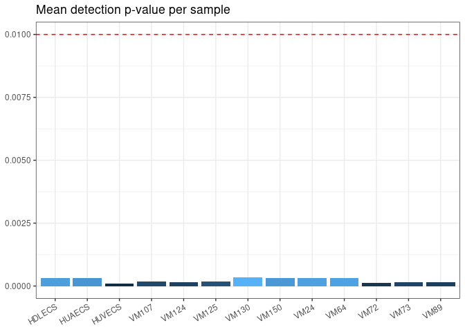
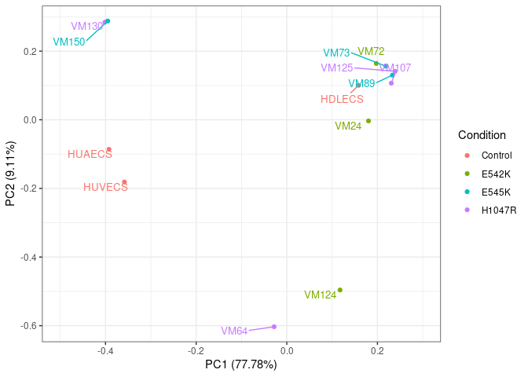
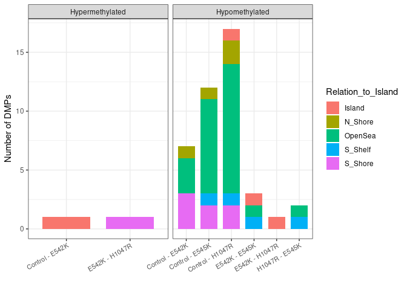
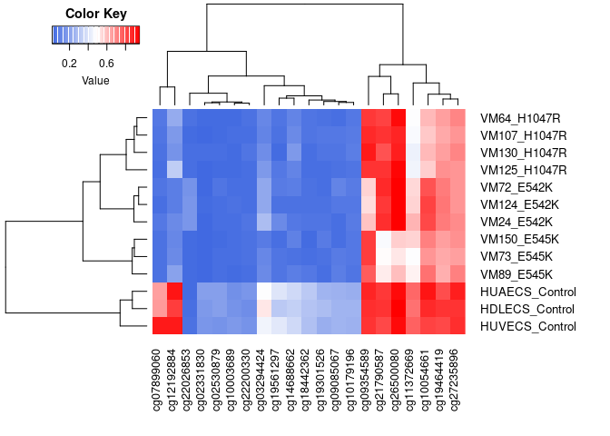
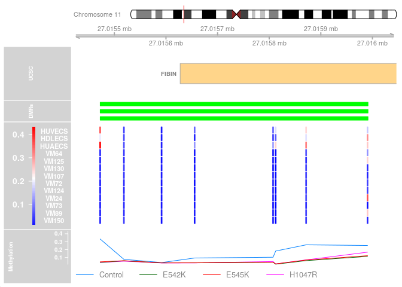

Analysis of human methylation data with R
================

## Description

This document describes the workflow for analyzing of human methylation
array data using R and mainly three Bioconductor packages: `minfi`,
`limma`, and `DMRcate`. It includes the import and preprocessing of the
data, followed by differential methylation analysis to find and annotate
differentially methylated positions (DMPs) and regions (DMRs).

> **Note**: This document is the markdown version of the
> [EPIC.R](https://github.com/raulsanzr/methylation/blob/main/R/EPIC.R)
> script.

## Required packages

``` r
library(minfi) # BiocManager::install("minfi")
library(limma) # BiocManager::install("limma")
library(DMRcate) # BiocManager::install("DMRcate")
library(maxprobes) # devtools::install_github("markgene/maxprobes")
library(readxl) # install.packages("readxl")
library(dplyr) # install.packages("dplyr")
library(ggplot2) # install.packages("ggplot2")
library(ggrepel) # install.packages("ggrepel")
library(ggfortify) # install.packages("ggfortify")
library(gplots) # install.packages("gplots")
library(RColorBrewer) # install.packages("RColorBrewer")
library(methtools) # devtools::install_github("raulsanzr/methtools")
```

## Loading the data

### Methylation data

The data for this study was produced by the *Infinium MethylationEPIC
BeadChip* array designed by Illumina in 2016. This microarray quantifies
the methylation levels in more than 850,000 different CpG sites of the
human genome. However, this workflow can also be used with data obtained
from the previous version of the chip (*Infinium HumanMethylation450
BeadChip*) by changing a couple of parameters.

The following function from `minfi` can read all the IDAT files produced
by the array and store this data in an RGChannelSet object with its
corresponding annotation.

``` r
rgSet <- read.metharray.exp("data/human/") # folder where the IDAT files are placed
```

### Metadata

The metadata includes relevant information about the samples that will
be useful later to group them.

``` r
metadata <- as.data.frame(read_excel("data/human/PIK3CA_samples_SC.xlsx"))

# renaming variables and removing redundant information
names(metadata)[1:10] <- c("Sample", "Organism", "Tissue", "Type", "Condition", "Preservation", 
                           "DNA_quantity", "EPIC_ID", "EPIC_position", "EPIC_barcode")
metadata$CellType <- paste(metadata$CellType1, metadata$CellType2, sep="_" )
metadata$CellType <- gsub("thelial","", gsub("_NA","", as.character(metadata$CellType)))
metadata$Condition <- gsub("pik3ca ","", as.character(metadata$Condition))
metadata$Type <- gsub("Vascular malformation", "Mutation", metadata$Type)
metadata <- metadata[,-c(2, 3, 6, 8, 9, 12, 13, 14)]

head(metadata)
```

    ##   Sample     Type Condition DNA_quantity        EPIC_barcode       CellType
    ## 1 HUVECS   Normal   Control           83 205832320126_R03C01     endo_blood
    ## 2 HDLECS   Normal   Control           75 205832320126_R04C01 endo_lymphatic
    ## 3 HUAECS   Normal   Control           63 205832320126_R05C01     endo_blood
    ## 4   VM64 Mutation    H1047R           56 205832320126_R06C01     endo_blood
    ## 5  VM125 Mutation    H1047R           80 205832320126_R07C01 endo_lymphatic
    ## 6  VM130 Mutation    H1047R           67 205832320126_R08C01     fibroblast

## Quality control

### QC report

`minfi` incorporates a function that generates a quality control report
from the raw data in PDF format. It includes plots representing the
distribution of the detected methylation intensities for each sample and
at each detection step.

``` r
qcReport(rgSet, pdf="results/human/qcReport.pdf", sampGroups=metadata$Condition, sampNames=metadata$Sample)
```

### Detection p-values

Detection p-values provide a measure of how likely the signal of a probe
is different from the background. The next barplot shows the mean of the
detection p-values for every sample with respect to the cutoff
().

``` r
# detection p-values
p_values <- detectionP(rgSet, type="m+u")

# mean detection p-values
mean_p <- data.frame(p_values=colMeans(p_values), Sample=metadata$Sample)

# plotting the mean detection p-values
ggplot(mean_p, aes(x=Sample, y=p_values, fill=p_values))+
  geom_col()+
  geom_hline(yintercept=0.01, linetype="dashed", color="red")+
  ggtitle("Mean detection p-value per sample")+
  theme_bw()+
  theme(legend.position="none", axis.title.x=element_blank(), axis.title.y=element_blank(), 
        axis.text.x=element_text(angle=30, vjust=1, hjust=1))
```

<!-- -->

## Preprocessing

### Normalization

There are some different options to normalize the data with `minfi`.
Which one to use will always depend on the characteristics of the data
to analyze.

-   `preprocessRaw`: No normalization.
-   `preprocessIllumina`: Illumina’s GenomeStudio preprocessing.
-   `preprocessSWAN`: Subset-quantile within array normalization.
-   `preprocessQuantile`: Quantile normalization.
-   `preprocessNoob`: Normal-exponential out-of-band background
    correction.
-   `preprocessFunnorm`: Functional normalization.

> Find more documentation about the different preprocessing
> functions
> [here](https://www.bioconductor.org/help/course-materials/2015/BioC2015/methylation450k.html#preprocessing-and-normalization).

``` r
mSet <- preprocessNoob(rgSet)
```

### Removing low quality probes

Probes with a detection p-value above the cutoff
()
are not significant and may not be reliable enough. It is recommended to
remove those sites to avoid biases.

``` r
keep <- rowSums(p_values < 0.01) == ncol(mSet)
mSet <- mSet[keep,]
```

### Removing probes with known SNPs

The function `dropLociWithSnps` allows discarding those probes known to
have a single nucleotide polymorphism.

``` r
gmSet <- dropLociWithSnps(mapToGenome(mSet))
```

### Removing cross reactive probes

Cross-reactive probes are sites found to map at different genome
locations (which usually involves an autosomal and a sex chromosome). In
the function `xreactive_probes` there are collected and annotated those
probes found in [Pidsley et
al.](https://genomebiology.biomedcentral.com/articles/10.1186/s13059-016-1066-1)
and [McCartney et
al.](https://www.sciencedirect.com/science/article/pii/S221359601630071X)
studies.

``` r
xreactive_probes <- xreactive_probes(array_type="EPIC")
keep <- !(featureNames(gmSet) %in% xreactive_probes)
gmSet <- gmSet[keep,]
```

### Removing sex chromosomes probes

CpG sites present at the sexual chromosomes (chrX and chrY) can be
differently methylated in males and females for many other factors not
included in the analysis. In this case, those probes should be removed
because the gender of the individuals is not a variable under study.
However, if we were interested in studying the differences in
methylation between males and females, we should keep those sites.

``` r
ann <- getAnnotation(IlluminaHumanMethylationEPICanno.ilm10b4.hg19)
keep <- !(featureNames(gmSet) %in% ann$Name[ann$chr %in% c("chrX","chrY")])
gmSet <- gmSet[keep,]
```

### Obtaining the beta values

The beta-value is a measurement of the methylation at the CpG site level
that ranges between 0 and 1, representing a completely unmethylated or
methylated site, respectively. It can be calculated using the following
formula:


``` r
beta_values <- getBeta(gmSet)
colnames(beta_values) <- metadata$Sample
head(beta_values[,1:6])
```

    ##               HUVECS    HDLECS    HUAECS      VM64     VM125     VM130
    ## cg26928153 0.8912966 0.9291646 0.9008487 0.9208086 0.8975076 0.8765710
    ## cg16269199 0.7217106 0.8779706 0.7257139 0.7652507 0.8260288 0.5582238
    ## cg13869341 0.8169154 0.9312310 0.8497294 0.9202811 0.8743728 0.8745551
    ## cg24669183 0.7814387 0.7503673 0.8029873 0.8039348 0.8153838 0.7674553
    ## cg26679879 0.4946208 0.4945805 0.4945518 0.5173384 0.4840949 0.5003178
    ## cg22519184 0.5386525 0.5379105 0.5434246 0.5342965 0.5453343 0.5494639

## Principal Component Analysis

Principal Component Analysis (PCA) is a dimensionality reduction
technique used to reduce a data set with many variables into a few
called principal components. Those are variables built by the
combination of the initial ones that aim to explain as much variance as
possible in order to be able to represent the data in two (or three)
dimensions.

### PCA on the most variable sites

Selecting the sites with higher variation across the samples is an
approach to reduce the number of inputs and speed up the PCA
calculation. However, the number of selected sites should be large
enough not to reduce the performance of the PCA.

``` r
# selecting the top 100 most variable CpGs
sdv <- apply(beta_values,1, sd)
keep <- names(head(sort(sdv,decreasing=T), 100))
beta_top100 <- beta_values[keep,]

# PCA calculation
pca_res <- prcomp(t(beta_top100), scale=T, center=T) # ! the matrix needs to transpose
```

#### Plotting by condition

``` r
autoplot(pca_res, x=1, y=2,data=metadata, colour="Condition")+
  geom_text_repel(aes(label=Sample, color=Condition),hjust=-0.1, vjust=0, show.legend=F, size=4)+
  xlim(c(-0.5,0.3)) +
  scale_color_brewer(palette="Set2")+ 
  theme_bw()+
  ggtitle("PCA by condition")
```

<!-- -->

## Differential methylation analysis

### Differentially Methylated Positions

The differentially methylated positions (DMPs) are individual CpG sites
showing statistically different methylation levels across the study
samples.

#### Finding DMPs

Those positions can be detected using `limma` to build linear models
that look for significant differences in the beta values at single
probes. In this case, all pairwise comparisons will be performed for the
samples grouped by condition.

``` r
# building the design matrix
mutation <- factor(metadata$Condition)
designMat <- model.matrix(~0+mutation, data=metadata)
colnames(designMat) <- levels(mutation)

# building the contrast matrix
contMat <- makeContrasts(Control-E542K, 
                         Control-E545K, 
                         Control-H1047R, 
                         E542K-E545K, 
                         E542K-H1047R, 
                         H1047R-E545K, levels=designMat)

# fitting linear model with limma
fit <- lmFit(beta_values, designMat)
fit2 <- contrasts.fit(fit, contMat)
fit2 <- eBayes(fit2)

summary(decideTests(fit2, p.value=0.01))
```

> DMPs can be either hypomethylated (loss of methylation) or
> hypermethylated (gain of methylation) sites.

|                   | Hypomethylated | Hypermethylated | TOTAL |
|:------------------|:--------------:|:---------------:|:-----:|
| Control vs E542K  |       7        |        1        |   8   |
| Control vs E545K  |       12       |        0        |  12   |
| Control vs H1047R |       17       |        0        |  17   |
| E542K vs E545K    |       3        |        0        |   3   |
| E542K vs H1047R   |       1        |        1        |   2   |
| H1047R vs E545K   |       2        |        0        |   2   |

#### Annotating the DMPs

In the previous step, we obtained differently methylated sites, but
annotating them will provide more specific information relative to where
they are located in the genome.

``` r
contrasts <- colnames(contMat)

# matching beta values with annotation by the probe names
annEPICSub <- ann.cpg(cpgs=beta_values, array="EPIC", what="short")

DMP.list <- data.frame() # df to store the DMPs
cg <- list() # list to store the names of significant probes

for (i in 1:length(contrasts)){
  # extract the significant DMPs and annotate
  DMP <- topTable(fit2, num=Inf, coef=i, genelist=annEPICSub, p.value=0.01)
  DMP$Contrast <- contrasts[i]
  # saving the results
  DMP.list <- rbind(DMP.list, DMP)
  cg[[i]] <- row.names(DMP)
}

# write.csv(DMP.list, "results/human/DMP_list.csv")

### merging all the DMP's
DMP_ann <- DMP.list

# classifying DMPs according to its change in methylation
DMP_ann$Type <- "Hypermethylated"
DMP_ann$Type[which(DMP_ann$logFC > 0)] <- "Hypomethylated"

# gene feature annotation
DMP_ann$UCSC_RefGene_Group[which(DMP_ann$UCSC_RefGene_Group == "")] <- "."
DMP_ann$UCSC_RefGene_Group_short <- unlist(lapply(strsplit(DMP_ann$UCSC_RefGene_Group,";"),'[[', 1))
```

#### DMPs by CpG islands

``` r
DMP_annCGI <- DMP_ann[, c("Contrast", "Relation_to_Island", "Type")]

ggplot(DMP_annCGI, aes(Contrast, fill=Relation_to_Island))+
  facet_wrap(.~Type, scales="free_x")+
  geom_histogram(stat="count", width=0.75)+
  theme_bw()+ 
  theme(axis.text.x=element_text(angle=30, hjust=1, size=8))+
  ylab("Number of DMPs")+ 
  xlab("")
```

<!-- -->

#### DMPs by gene elements

``` r
DMP_Gene_Group <- DMP_ann[,c("Contrast","UCSC_RefGene_Group_short", "Type")]

ggplot(DMP_Gene_Group, aes(Contrast, fill=UCSC_RefGene_Group_short))+
  facet_wrap(.~Type, scales="free_x")+
  geom_histogram(stat="count", width=0.75)+ 
  theme_bw()+ 
  scale_fill_brewer(palette="Set2")+
  theme(axis.text.x=element_text(angle=30, hjust=1, size=8))+
  ylab("Number of DMPs")+
  xlab("")+ 
  labs(fill="UCSC_RefGene")
```

<!-- -->

#### Heatmap of DMPs

``` r
# joining the DMPs with their beta values
DMP_beta <- data.frame(beta_values[unlist(cg), ])
colnames(DMP_beta) <- paste0(metadata$Sample,"_",metadata$Condition)

colors <- colorRampPalette(c("royalblue", "white", "red"))(n=100) # range of colors
heatmap.2(as.matrix(t(unique(DMP_beta))), trace="none", density.inf="none", 
          margins=c(7,10), col=colors, cexRow = 1, lwid = c(5,15), lhei = c(5,15))
```

<!-- -->

### Differentially Methylated Regions

Differentially methylated regions (DMRs) rely on the same principle as
DMPs. However, instead of looking at single sites, the difference in
methylation is compared at regions formed by two or more CpGs.

#### Finding and annotating DMRs

`DMRcate` is a package that allows finding and annotating DMRs from the
beta values given a design and a contrast matrix. It generates a
GenomicRanges object containing the coordinates of the DMR and some
statistics that support the finding.

``` r
DMR.list <- data.frame()
for(i in 1:length(contrasts)){
  # annotating the CpG's for each contrast + finding significant CpG's
  myAnnotation <- cpg.annotate(object=beta_values, datatype="array", what="Beta",contrasts=T,  
                               design=designMat, cont.matrix=contMat, analysis.type="differential",
                               coef=gsub("_", " - ", as.character(contrasts[i])), arraytype="EPIC")
  
  if(sum(myAnnotation@ranges@elementMetadata@listData$is.sig)!=0){ # if there are significant CpG's
    # test for DMRs
    DMR_raw <- dmrcate(myAnnotation, lambda=1000, C=2)
    # extract genomic ranges
    results.ranges <- extractRanges(DMR_raw)
    # saving the results
    DMR <- data.frame(Contrast=contrasts[i], results.ranges)
    DMR.list <- rbind(DMR.list, DMR)
  }
}

DMR.list$overlapping.genes <- unlist(DMR.list$overlapping.genes)
# write.csv(DMR.list, "results/human/DMR_list.csv")

# showing the found DMRs for the first contrast: control vs E542K
head(DMR.list[,c(2:7,14)], 5)
```

    ##   seqnames     start       end width strand no.cpgs overlapping.genes
    ## 1     chr5   1020022   1020109    88      *       2              NKD2
    ## 2     chr8 145008288 145008397   110      *       2              PLEC
    ## 3    chr11  27015473  27015991   519      *       8             FIBIN
    ## 4     chr5 134915042 134915537   496      *       6      CTC-321K16.1
    ## 5    chr11  70672388  70673256   869      *       9            SHANK2

#### Plotting DMRs

``` r
CpGs <- gmSet@rowRanges
values(CpGs) <- beta_values

methplot(genome="hg19", chr="chr11", start=27015473, end=27015991, sites=CpGs, regions=DMR.list, group=metadata$Condition)
```

<!-- -->

> Plot produced with [methplot](https://github.com/raulsanzr/cpgplot).

## Session information

    ## R version 4.1.2 (2021-11-01)
    ## Platform: x86_64-redhat-linux-gnu (64-bit)
    ## Running under: Rocky Linux 8.5 (Green Obsidian)
    ## 
    ## Matrix products: default
    ## BLAS/LAPACK: /usr/lib64/libopenblas-r0.3.12.so
    ## 
    ## locale:
    ##  [1] LC_CTYPE=en_GB.UTF-8       LC_NUMERIC=C              
    ##  [3] LC_TIME=en_GB.UTF-8        LC_COLLATE=en_GB.UTF-8    
    ##  [5] LC_MONETARY=en_GB.UTF-8    LC_MESSAGES=en_GB.UTF-8   
    ##  [7] LC_PAPER=en_GB.UTF-8       LC_NAME=C                 
    ##  [9] LC_ADDRESS=C               LC_TELEPHONE=C            
    ## [11] LC_MEASUREMENT=en_GB.UTF-8 LC_IDENTIFICATION=C       
    ## 
    ## attached base packages:
    ## [1] parallel  stats4    stats     graphics  grDevices utils     datasets 
    ## [8] methods   base     
    ## 
    ## other attached packages:
    ##  [1] DMRcatedata_2.12.0                                 
    ##  [2] ExperimentHub_2.2.1                                
    ##  [3] AnnotationHub_3.2.2                                
    ##  [4] BiocFileCache_2.2.1                                
    ##  [5] dbplyr_2.1.1                                       
    ##  [6] IlluminaHumanMethylationEPICanno.ilm10b4.hg19_0.6.0
    ##  [7] IlluminaHumanMethylationEPICmanifest_0.3.0         
    ##  [8] methtools_0.0.2.0                                  
    ##  [9] RColorBrewer_1.1-3                                 
    ## [10] gplots_3.1.3                                       
    ## [11] ggfortify_0.4.14                                   
    ## [12] ggrepel_0.9.1                                      
    ## [13] ggplot2_3.3.6                                      
    ## [14] dplyr_1.0.9                                        
    ## [15] readxl_1.4.0                                       
    ## [16] maxprobes_0.0.2                                    
    ## [17] DMRcate_2.8.3                                      
    ## [18] limma_3.50.3                                       
    ## [19] minfi_1.40.0                                       
    ## [20] bumphunter_1.36.0                                  
    ## [21] locfit_1.5-9.5                                     
    ## [22] iterators_1.0.14                                   
    ## [23] foreach_1.5.2                                      
    ## [24] Biostrings_2.62.0                                  
    ## [25] XVector_0.34.0                                     
    ## [26] SummarizedExperiment_1.24.0                        
    ## [27] Biobase_2.54.0                                     
    ## [28] MatrixGenerics_1.6.0                               
    ## [29] matrixStats_0.62.0                                 
    ## [30] GenomicRanges_1.46.1                               
    ## [31] GenomeInfoDb_1.30.1                                
    ## [32] IRanges_2.28.0                                     
    ## [33] S4Vectors_0.32.4                                   
    ## [34] BiocGenerics_0.40.0                                
    ## 
    ## loaded via a namespace (and not attached):
    ##   [1] utf8_1.2.2                                        
    ##   [2] R.utils_2.11.0                                    
    ##   [3] tidyselect_1.1.2                                  
    ##   [4] RSQLite_2.2.14                                    
    ##   [5] AnnotationDbi_1.56.2                              
    ##   [6] htmlwidgets_1.5.4                                 
    ##   [7] grid_4.1.2                                        
    ##   [8] BiocParallel_1.28.3                               
    ##   [9] munsell_0.5.0                                     
    ##  [10] codetools_0.2-18                                  
    ##  [11] preprocessCore_1.56.0                             
    ##  [12] statmod_1.4.36                                    
    ##  [13] withr_2.5.0                                       
    ##  [14] colorspace_2.0-3                                  
    ##  [15] filelock_1.0.2                                    
    ##  [16] highr_0.9                                         
    ##  [17] knitr_1.39                                        
    ##  [18] rstudioapi_0.13                                   
    ##  [19] labeling_0.4.2                                    
    ##  [20] GenomeInfoDbData_1.2.7                            
    ##  [21] farver_2.1.0                                      
    ##  [22] bit64_4.0.5                                       
    ##  [23] rhdf5_2.38.1                                      
    ##  [24] vctrs_0.4.1                                       
    ##  [25] generics_0.1.2                                    
    ##  [26] xfun_0.31                                         
    ##  [27] biovizBase_1.42.0                                 
    ##  [28] R6_2.5.1                                          
    ##  [29] illuminaio_0.36.0                                 
    ##  [30] AnnotationFilter_1.18.0                           
    ##  [31] bitops_1.0-7                                      
    ##  [32] rhdf5filters_1.6.0                                
    ##  [33] cachem_1.0.6                                      
    ##  [34] reshape_0.8.9                                     
    ##  [35] DelayedArray_0.20.0                               
    ##  [36] assertthat_0.2.1                                  
    ##  [37] IlluminaHumanMethylation450kanno.ilmn12.hg19_0.6.0
    ##  [38] promises_1.2.0.1                                  
    ##  [39] BiocIO_1.4.0                                      
    ##  [40] scales_1.2.0                                      
    ##  [41] bsseq_1.30.0                                      
    ##  [42] nnet_7.3-17                                       
    ##  [43] gtable_0.3.0                                      
    ##  [44] ensembldb_2.18.4                                  
    ##  [45] rlang_1.0.2                                       
    ##  [46] genefilter_1.76.0                                 
    ##  [47] splines_4.1.2                                     
    ##  [48] rtracklayer_1.54.0                                
    ##  [49] lazyeval_0.2.2                                    
    ##  [50] DSS_2.42.0                                        
    ##  [51] GEOquery_2.62.2                                   
    ##  [52] dichromat_2.0-0.1                                 
    ##  [53] checkmate_2.1.0                                   
    ##  [54] BiocManager_1.30.17                               
    ##  [55] yaml_2.3.5                                        
    ##  [56] GenomicFeatures_1.46.5                            
    ##  [57] backports_1.4.1                                   
    ##  [58] httpuv_1.6.5                                      
    ##  [59] Hmisc_4.6-0                                       
    ##  [60] tools_4.1.2                                       
    ##  [61] nor1mix_1.3-0                                     
    ##  [62] ellipsis_0.3.2                                    
    ##  [63] siggenes_1.68.0                                   
    ##  [64] Rcpp_1.0.8.3                                      
    ##  [65] plyr_1.8.7                                        
    ##  [66] base64enc_0.1-3                                   
    ##  [67] sparseMatrixStats_1.6.0                           
    ##  [68] progress_1.2.2                                    
    ##  [69] zlibbioc_1.40.0                                   
    ##  [70] purrr_0.3.4                                       
    ##  [71] RCurl_1.98-1.6                                    
    ##  [72] prettyunits_1.1.1                                 
    ##  [73] rpart_4.1-15                                      
    ##  [74] openssl_2.0.0                                     
    ##  [75] cluster_2.1.2                                     
    ##  [76] magrittr_2.0.3                                    
    ##  [77] data.table_1.14.2                                 
    ##  [78] ProtGenerics_1.26.0                               
    ##  [79] missMethyl_1.28.0                                 
    ##  [80] mime_0.12                                         
    ##  [81] hms_1.1.1                                         
    ##  [82] evaluate_0.15                                     
    ##  [83] xtable_1.8-4                                      
    ##  [84] XML_3.99-0.9                                      
    ##  [85] jpeg_0.1-9                                        
    ##  [86] mclust_5.4.9                                      
    ##  [87] gridExtra_2.3                                     
    ##  [88] compiler_4.1.2                                    
    ##  [89] biomaRt_2.50.3                                    
    ##  [90] tibble_3.1.7                                      
    ##  [91] KernSmooth_2.23-20                                
    ##  [92] crayon_1.5.1                                      
    ##  [93] R.oo_1.24.0                                       
    ##  [94] htmltools_0.5.2                                   
    ##  [95] later_1.3.0                                       
    ##  [96] tzdb_0.3.0                                        
    ##  [97] Formula_1.2-4                                     
    ##  [98] tidyr_1.2.0                                       
    ##  [99] DBI_1.1.2                                         
    ## [100] MASS_7.3-55                                       
    ## [101] rappdirs_0.3.3                                    
    ## [102] Matrix_1.4-0                                      
    ## [103] readr_2.1.2                                       
    ## [104] permute_0.9-7                                     
    ## [105] cli_3.3.0                                         
    ## [106] quadprog_1.5-8                                    
    ## [107] R.methodsS3_1.8.1                                 
    ## [108] Gviz_1.38.2                                       
    ## [109] TxDb.Hsapiens.UCSC.hg19.knownGene_3.2.2           
    ## [110] pkgconfig_2.0.3                                   
    ## [111] GenomicAlignments_1.30.0                          
    ## [112] foreign_0.8-82                                    
    ## [113] xml2_1.3.3                                        
    ## [114] annotate_1.72.0                                   
    ## [115] rngtools_1.5.2                                    
    ## [116] multtest_2.50.0                                   
    ## [117] beanplot_1.3.1                                    
    ## [118] doRNG_1.8.2                                       
    ## [119] scrime_1.3.5                                      
    ## [120] stringr_1.4.0                                     
    ## [121] VariantAnnotation_1.40.0                          
    ## [122] digest_0.6.29                                     
    ## [123] cellranger_1.1.0                                  
    ## [124] rmarkdown_2.14                                    
    ## [125] base64_2.0                                        
    ## [126] htmlTable_2.4.0                                   
    ## [127] edgeR_3.36.0                                      
    ## [128] DelayedMatrixStats_1.16.0                         
    ## [129] restfulr_0.0.13                                   
    ## [130] curl_4.3.2                                        
    ## [131] shiny_1.7.1                                       
    ## [132] Rsamtools_2.10.0                                  
    ## [133] gtools_3.9.2                                      
    ## [134] rjson_0.2.21                                      
    ## [135] lifecycle_1.0.1                                   
    ## [136] nlme_3.1-155                                      
    ## [137] Rhdf5lib_1.16.0                                   
    ## [138] askpass_1.1                                       
    ## [139] BSgenome_1.62.0                                   
    ## [140] fansi_1.0.3                                       
    ## [141] pillar_1.7.0                                      
    ## [142] lattice_0.20-45                                   
    ## [143] KEGGREST_1.34.0                                   
    ## [144] fastmap_1.1.0                                     
    ## [145] httr_1.4.3                                        
    ## [146] survival_3.2-13                                   
    ## [147] interactiveDisplayBase_1.32.0                     
    ## [148] glue_1.6.2                                        
    ## [149] png_0.1-7                                         
    ## [150] BiocVersion_3.14.0                                
    ## [151] bit_4.0.4                                         
    ## [152] stringi_1.7.6                                     
    ## [153] HDF5Array_1.22.1                                  
    ## [154] blob_1.2.3                                        
    ## [155] org.Hs.eg.db_3.14.0                               
    ## [156] caTools_1.18.2                                    
    ## [157] latticeExtra_0.6-29                               
    ## [158] memoise_2.0.1
